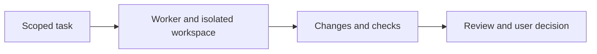

# Fork overview

This repository is a fork of
[Untrivial-ai/agent-orchestrator](https://github.com/Untrivial-ai/agent-orchestrator).
Agent Orchestrator, the interface images and the original documentation are
the work of upstream and its contributors. Downloads and badges in the inherited
README refer to upstream; this fork does not establish a separate product release.

## A visual first look

The existing [delegation demonstration](screenshots/delegation-demo/delegation-demo.gif)
shows the upstream workflow. These assets were already in the repository; they
are not new screenshots of an application run during this documentation update.

For a fictional practice task, use an expendable demo repository and describe an
observable outcome, such as “Correct a heading and preserve every other page”.
The documented flow is to create a worker, choose its agent and inspect its
changes and review state before merging. See the [original walkthrough](../README.md)
and [current source status](STATUS.md) for the implemented scope and limitations.

No desktop build, daemon session or agent benchmark was run for this update.

[Documentation index](README.md) · [License](../LICENSE) ·
[Upstream releases](https://github.com/Untrivial-ai/agent-orchestrator/releases)
